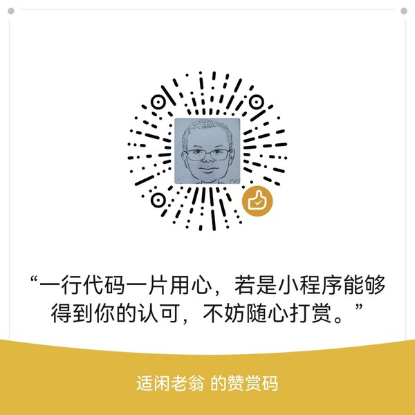

# 青简主题（QingJian / qingya）

> 青竹为简，记录时光。一个面向中文博客与展示站点的轻量 WordPress 主题。

## ✨ 简介

青简是一款完全自研的 WordPress 经典主题（无第三方框架依赖），适用于：

- 个人/自媒体博客：文章分类、标签、归档、评论、相关推荐
- 资讯内容站：图文列表、置顶推荐、专题聚合
- 轻量化产品展示站：产品分类、详情页、图文介绍、留言咨询
- 展示站：首页轮播、图文展示、关于我们、联系表单

**设计语言**：闲适清简、书卷气。暖米底色 + 竹青主色 + 深墨绿页脚，深浅色模式一键切换。

## 📦 特性

### 🏠 多套首页布局（Customizer 一键切换）
- **经典**（原首页）：轮播 + 置顶/推荐区 + 最新文章列表
- **门户综合**：轮播 + 分类直达（小按钮 + 每类最新 3 篇）+ 热门高赞（列表）+ 开源项目区（推荐/IT 分类）+ 股市消息区
- **杂志资讯**：轮播 + 文章图片墙（瀑布流交错、标题叠图、无摘要、点击阅读）+ 财经快讯条
- **极简文章**：分类直达 + 文章列表（可翻页）+ 财经快讯折叠条
- 随时可切回「经典」恢复原首页；所有布局共用轮播、侧边栏、AI 客服

### 📈 股市消息区（首页分区，服务端抓取 + 缓存）
- **热门消息**：东方财富 7x24 快讯 + 巨潮资讯当日公告
- **突发消息**：新浪财经 7x24 快讯（停牌/异动/涨停等关键词自动标记"突发"）
- **本站观点**：股票/行业分类文章（分类名可配）
- 数据缓存默认 30 分钟（可配），任一接口失败自动隐藏对应区块，不影响页面

### 🎠 轮播（内置默认图）
- 4 个轮播位：图片 + 标题 + 简介 + 阅读按钮（Customizer 配置，配了才显示对应元素）
- **内置默认图**（assets/img/carousel-*.webp）：未配置时自动回退，开箱即用
- 移动端轮播高度跟随图片比例，**完整显示不裁剪**（图上文字不会丢）

### 🔒 IP 黑名单系统（内置）
- 后台可视化批量录入：单 IP、IP 段（`192.168.1.*`）、CIDR（`123.45.67.0/24`）
- 拦截策略：403 / 跳转提示页 / 跳转指定 URL
- 白名单豁免 + 搜索引擎蜘蛛自动放行（百度/谷歌等）
- 访问日志记录（自定义数据表），后台可查可一键清空；境外拦截记录同样入日志（来源列区分）
- 总开关 + "仅前台拦截"模式（不影响后台登录）
- **白名单互通**：IP 黑名单白名单与境外拦截白名单互相认，任一命中即放行
- 登录保护自动拉黑写入同一黑名单（白名单 IP 豁免，管理员登录成功自动移除）

### 🌍 境外 IP 拦截（Geo 限制，可选）
- 基于 MaxMind GeoLite2-Country 数据库，仅允许中国大陆 IP 访问（可放行港澳台）
- 拦截范围：仅后台/登录页（推荐）/ 仅前台 / 全部；登录管理员无条件豁免
- 拦截后可选跳转指定 URL，否则 403；命中写入拦截日志（来源=境外拦截）

### 🤖 AI 智能客服（可开关）
- 右下角悬浮客服（移动端全屏），DeepSeek 中转
- RAG 站内检索：提问自动搜站内文章喂给 AI，禁止编造文章
- 安全链：nonce + 时间签名 + Referer + 单 IP 限流 + 连续高频临时封禁 + 境外 IP 拦截 + 敏感词过滤
- 夜间静默省额度；对话只存浏览器本地

### 🔍 SEO 原生优化（无插件依赖）
- 自动生成标准化 TDK，支持单篇/单页独立自定义
- 面包屑 + 文章 JSON-LD 结构化数据
- 图片 ALT 自动补充、canonical 规范化、robots.txt 兼容
- 冗余代码清理（shortlink/RSD 等）

### ⚡ 性能
- 资源版本化（filemtime 自动刷新缓存）、按需加载、脚本 defer
- 图片懒加载、CDN 域名配置（主题静态资源一键走 CDN）
- 可选精简模式（移除 emoji/embed 脚本）、可选禁用 jQuery Migrate

### 🛡 安全
- 移除 WP 版本信息、常见扫描器 UA 屏蔽（sqlmap/wpscan 等）
- 输入长度/分页参数校验、登录失败次数限制（可开关，3 次失败锁定 + 自动拉黑）
- 目录访问保护（.htaccess + 空 index）
- **残留短代码过滤**：小工具中误写的未注册短代码（如 `[chatbot ...]`）自动不渲染，不会显示成代码

### 🧩 基础能力
- **后台可视化配置**（Customizer，实时预览）：LOGO、顶部公告、联系方式、底部版权、ICP 备案号、友情链接、6 项配色、字体、布局、LOGO 高度等
- **一键换肤**：内置 4 套配色方案（竹青书卷 / 水墨素简 / 青灰现代 / 暖咖复古），每套含配套深色模式
- **页面模板**：首页（轮播+图文+列表）、全宽页、无侧边栏页、404 页
- **全局模块**：自适应导航 + 移动端汉堡菜单、搜索、登录入口、面包屑、分页、返回顶部、图片懒加载
- 文章浏览量统计（Cookie 防刷）、点赞、收藏（AJAX + nonce 校验）
- 阅读进度条、滚动渐入动画、深色/浅色模式切换（记忆用户偏好）
- 侧边栏小工具扩展：热门文章（按浏览量）、最新文章、随机文章
- 首页侧边栏：PC 常驻可折叠（收起后主栏全宽），移动端按钮展开

## 🚀 安装

1. 上传 `qingya-1.3.0.zip`：后台「外观 → 主题 → 安装主题 → 上传主题」，或解压至 `wp-content/themes/qingya/`
2. 启用主题
3. 前往「外观 → 自定义」进行可视化配置（首页布局、轮播图、股市区分类等）
4. 可选：创建页面选用「首页」模板，在「设置 → 阅读」中设为站点首页
5. 可选（境外拦截）：上传 `GeoLite2-Country.mmdb` 到 `wp-content/uploads/`

### 环境要求
- WordPress ≥ 6.0（已测 6.8 / 7.0 兼容）
- PHP ≥ 7.4（兼容 8.x）

## 📁 目录结构

```
qingya/
├── style.css              主题头信息 + 设计变量
├── functions.php          模块加载器（唯一入口）
├── front-page.php         首页入口（按布局设置分派）
├── inc/                   功能模块（低耦合，按需加载）
│   ├── setup.php          主题初始化（支持/菜单/侧边栏/布局类/残留短代码过滤）
│   ├── customizer.php     后台可视化配置（含首页布局选择）
│   ├── seo.php            原生 SEO（TDK/结构化数据/robots/ALT）
│   ├── security.php       安全防护（UA 屏蔽/输入过滤/登录保护自动拉黑）
│   ├── ip-blacklist.php   IP 黑名单核心逻辑 + 统一白名单
│   ├── geo-block.php      境外 IP 拦截（GeoLite2）
│   ├── performance.php    性能优化（版本化/CDN/懒加载/按需加载）
│   ├── template-tags.php  模板辅助（面包屑/浏览量/轮播/分页）
│   ├── home-layouts.php   首页分区渲染（分类直达/热门高赞/开源项目/图片墙/侧边栏）
│   ├── stock-news.php     股市消息数据源（东财/巨潮/新浪，抓取+缓存）
│   ├── ai-chatbot.php     AI 智能客服（DeepSeek + RAG + 风控）
│   ├── widgets.php        侧边栏小工具扩展
│   ├── meta-boxes.php     文章/页面独立 SEO 与布局 Meta
│   └── ajax.php           点赞/收藏/浏览量 AJAX 端点
├── admin/ip-blacklist.php IP 黑名单后台管理页
├── page-templates/        全宽/无侧边栏页面模板
├── template-parts/
│   ├── home/              classic / portal / magazine / minimal 四套首页布局
│   └── content/           内容片段
└── assets/                css/js/img（含默认轮播图 carousel-*.webp）
```

## 🛠 开发

- 编码规范：WordPress Coding Standards
- 资源：原生 CSS/JS（零第三方依赖），系统字体
- 模块加载：`functions.php` 按清单 require，前台零冗余

```bash
# 语法检查
php -l functions.php && php -l inc/*.php

# 重新打包（保留子目录结构；注意 os.walk 需用 relpath 生成包内路径）
python -c "import zipfile,os; z=zipfile.ZipFile('qingya-1.3.0.zip','w',zipfile.ZIP_DEFLATED); [(z.write(os.path.join(r,f), os.path.relpath(os.path.join(r,f),'.').replace(chr(92),'/')),) for r,d,fs in os.walk('qingya') for f in fs]; z.close()"
```

### 数据源（股市消息区）
| 区块 | 接口 | 说明 |
|---|---|---|
| 热门消息 | `newsapi.eastmoney.com/kuaixun/v1/getlist_102_ajaxResult_50_1_.html` | 东方财富 7x24 快讯（JSONP，需剥离前缀） |
| 上市公司公告 | `www.cninfo.com.cn/new/hisAnnouncement/query`（POST） | 巨潮资讯当日公告，需 Referer 头 |
| 突发消息 | `zhibo.sina.com.cn/api/zhibo/feed?zhibo_id=152` | 新浪财经 7x24，按关键词标记突发 |
- 全部服务端 `wp_remote_*` 抓取 + transient 缓存（默认 30 分钟），失败自动降级

## 📜 版本记录

### v1.3.0（2026-08-02）
- **多套首页布局**：经典 / 门户综合 / 杂志资讯 / 极简文章，Customizer 一键切换，随时可回原首页
- **股市消息区**：东方财富 7x24 快讯 + 巨潮公告 + 新浪 7x24 突发快讯 + 本站股票/行业文章（服务端抓取 + transient 缓存 30 分钟可配）
- **轮播升级**：4 张置顶大图卡片（标题 + 简介 + 阅读按钮）；内置 WebP 默认图，未配置自动回退；移动端高度跟随图片比例完整显示不裁剪
- **首页侧边栏**：PC 常驻可折叠（收起后主栏全宽），移动端按钮展开
- **门户分区调整**：分类直达 = 分类名 + 文章数徽章 + 每类最新 3 篇；热门高赞 / 开源项目改列表显示
- **杂志布局重做**：文章图片墙（瀑布流交错、标题叠图、无摘要、点击阅读）
- **残留短代码过滤**：小工具中未注册短代码（`[chatbot ...]`）自动不渲染
- **布局修复**：grid 特异性覆盖、`minmax(0,1fr)` 防溢出、移动端 991px block 流（CDP 实测无溢出无重叠）

### v1.2.0（2026-08-02）
- 白名单互通：IP 黑名单与境外拦截的白名单统一生效
- 境外拦截写入拦截日志（新增来源列：黑名单 / 境外拦截）

### v1.1.0（2026-08-01）
- AI 智能客服（DeepSeek 中转、RAG 站内检索、单 IP 限流封禁）
- 境外 IP 拦截（GeoLite2 数据库，可选）
- 登录保护：失败 3 次锁定 + 自动拉黑 IP

### v1.0.0（2026-07-31）
- 初始版本：全套模板、Customizer、SEO、IP 黑名单、性能、安全、深色模式、4 套配色方案

## 💝 赞赏

如果这个主题对您有帮助，欢迎打赏一杯茶/咖啡 ☕️🍵



您的支持是持续维护的动力！

## 📄 许可证

GPL v2 or later
